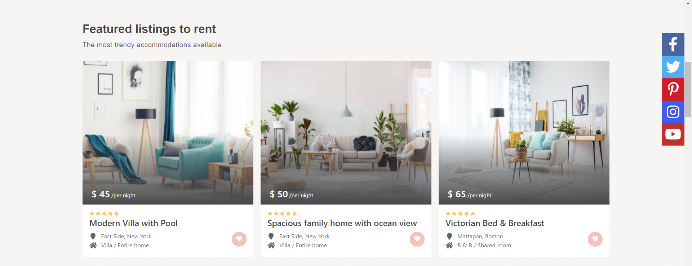

# Booking
&nbsp;

# Table of contents
1. [What is this repository about](#introduction)
2. [Tools and external libraries used for the project](#tools)
3. [Images of the project](#images)
4. [How to view the project](#installation)
5. [Contact](#Contact)
6. [License](#License)
7. [Acknowledgments](#Acknowledgments)
&nbsp;
---

### What is this repository about

#### Booking is my third repository in which I have recreated an existing website with as accurately similar styling as possible. The main idea of the project was to copy the looks of the website without looking into the source code and then to compare my own version with the original created by the authors for educational purposes. I chose this website specifically to keep on practicing and gaining experience in using the tools that I have used in my second repository (Book Bazar) to expand my knowledge and expertise as a React Developer. The link to the original website:
&nbsp;
[Booking](https://main.wprentals.org/)
&nbsp;
---

### Tools and external libraries used for the project
 1. HTML 5
 2. CSS 3
 3. React
 4. React Hooks
 5. React Router
 6. [Redux Library](https://redux.js.org/)
 7. [Flexbox](https://css-tricks.com/snippets/css/a-guide-to-flexbox/)
 8. [Font Awesome](https://fontawesome.com/)
&nbsp;
---

### Images of the Project
&nbsp;

&nbsp;

### How to view the project

#### In order to see the project simply clone the repository and run the index.html file in your browser.
&nbsp;
---

### Contact

#### You can contact me via my personal Email: dawidk65@gmail.com
&nbsp;
---

### License

#### This project is licensed under the MIT License
&nbsp;
---

### Acknowledgments

#### Booking Project is my third repository in which I have recreated an existing website for training purposes. I wanted to advance my skills as a React Developer and create a more complex project in comparison to the first repository. I have designed a website which is similar to Airbnb where the user can view apartments for short rent.
&nbsp;
